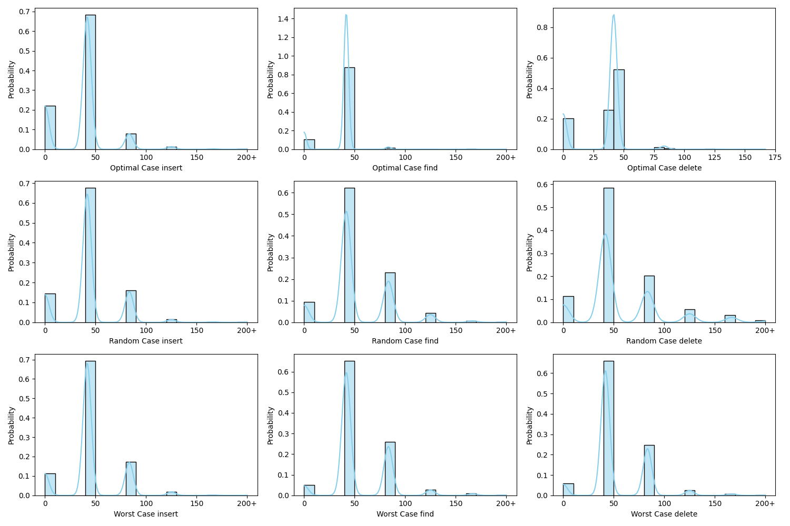
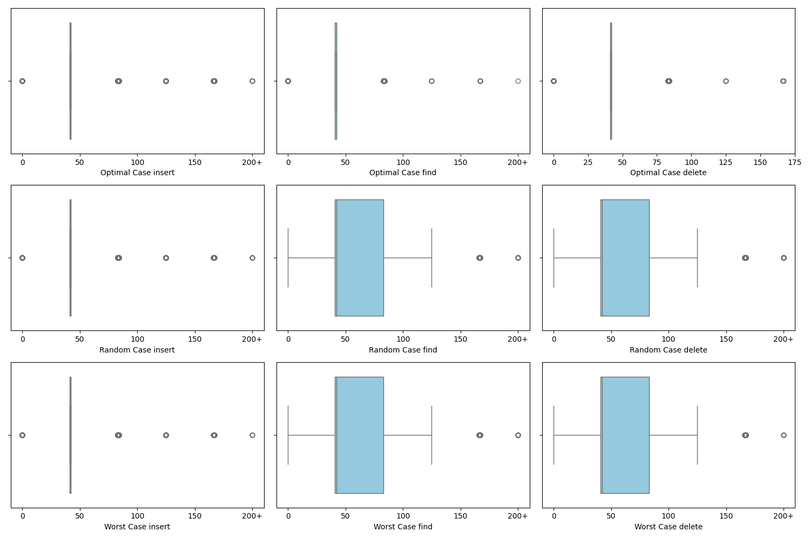
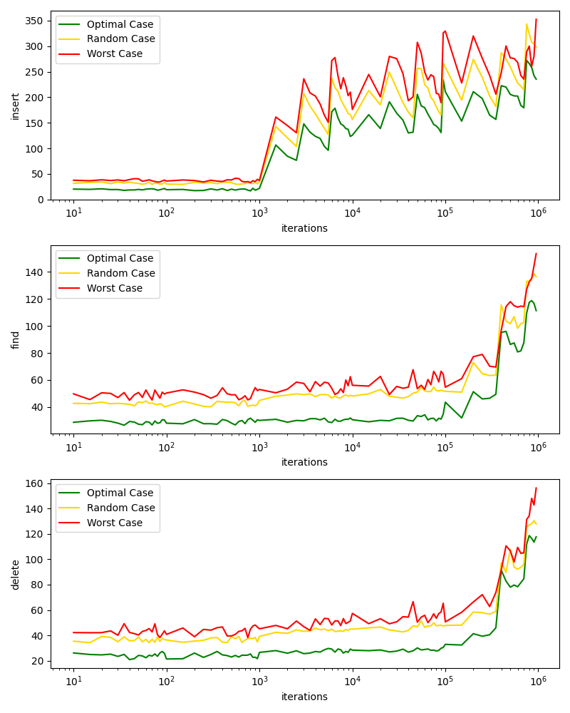
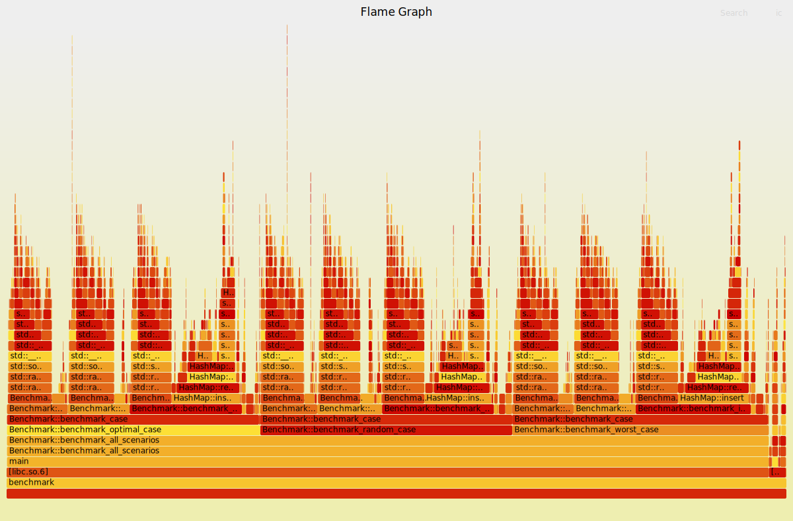
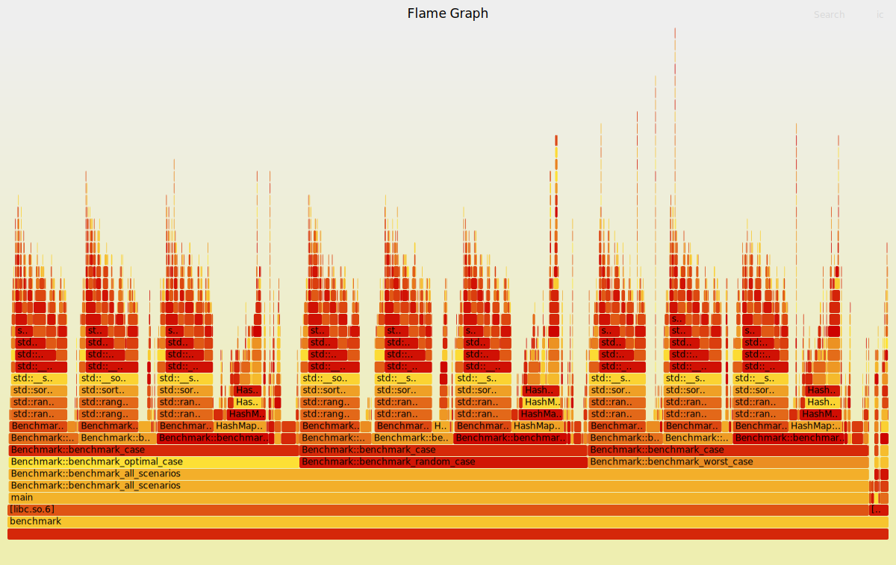

# Программирование на C++
## Лабораторная работа №1
№ ISU 335105 (вариант 2) - Хэш-таблица с открытой адресацией

### Общее описание

Была реализована структура hash-таблицы с открытой адресацией с поддержкой операций вставки, добавления и удаления элементов ([hashmap.h](hashmap.h) / [hashmap.cpp](hashmap.cpp)).

В качестве основного контейнера для хранения элементов был выбран `std::vector`, а сами ячейки имели следующую структуру:
```c++
enum EntryState {
    EMPTY,
    OCCUPIED,
    DELETED
};

struct Entry {
    int key;
    std::string value;
    EntryState state;

    Entry() : key(0), state(EMPTY) {}
};
```
Для оптимизации было решено использовать простые числа в качестве размера хэш-таблицы, так как в исследованиях было показано, что в таких случаях коллизии возникают реже. 

В качестве хэш-функции был выбран мультипликативный хэш:
```c++
size_t HashMap::hash(const int key) const {
    const uint _key = static_cast<uint>(key + (1 << 31));
    const double irr_key = static_cast<double>(_key) * PHI;
    const double fractional = irr_key - static_cast<uint>(irr_key);
    return static_cast<size_t>(static_cast<double>(table.size()) * fractional);
}
```
Где PHI - это дробная часть константы золотого сечения (0.618...)

Также, для уменьшия вероятности коллизий был выбран load factor = 0.7 для хэш-таблицы (т.е. когда таблица заполняется на 70% происходит рехэш). 

Процесс рехэша состоит из 3 этапов:
1. Находится следующее за `N_new = N_cur * 2` простое число, где `N_cur` текущий размер хэш-таблицы
2. Текущая таблица копируется в переменную, а после расширяется до нового значения `N_new`
3. В расшируенную таблицу вставляются все предыдущие элементы

После реализации словаря были реализованы бенчмарки, которые замеряли время исполнения каждой из базовых операций, рассчитывали статистики и выводили в stdout ([benchmark.h](benchmark.h) / [benchmark.cpp](benchmark.cpp))

Бенчмарк запускался для худшего, случайного и оптимального случая. Данные для худшего/оптимального случаев подбираются специально, чтобы достичь максимального/минимального числа возникаемых коллизий.

Для каждой операции бенчмарк запускает её `CYCLES = 100` раз и усредняет полученные результаты. Это было сделано, чтобы минимизировать влияние времени простоя программы (когда ОС отдаёт ядро другому процессу).

### Анализ производительности

Бенчмарки и хэшмапы компилировались практически без оптимизации (`-O0`), чтобы исключить влиение оптимизаторов.

Далее бенчмарк был запущен на 10.000 элементов и результаты работы проанализированы через python-код.

График вероятностей для всех случаев и операций:


Ящики с усами для всех случаев и операций:


По графикам видно, что у оптимального случая вероятность времени операции 0-10 нс сильно выше, чем у Random Case и Worst Case, а также выбросов с большим временем исполнения меньше.

Далее бенчмарк был запущен на количествах элементах от 10 до 1.000.000 (шаг увеличивался с ростом кол-ва элементов). Был получен следующий график по средему времени исполнения:


А также был построен FlameGraph для более детального анализа производительности хэш-мапы (файл [trace_old.svg](images/trace_old.svg)):


### Анализ и оптимизации

В процессе анализа Flamegraph было выяснено, что в целом хэш-мапа большую часть времени тратит именно на то, что и должно - рехэш таблицы. Но были выдвинуты и другие предположения для различных микро-оптимизаций:
* Была оптимизирована функция find_next_prime (поиска следующего простого числа), используя различные оптимизации, взятые из теории чисел;
* Был увеличен начальный размер HashMap с 11 -> 2053. Стало понятно, что больше всего рехэшей происходит при вставке первой тысячи-двух тысячах элементов, чтобы обойти это, просто изначально при инициализации сразу выделяем побольше памяти;
* При удалении объекта, он помечался DELETED и значение строки выставлялось в пустую строку, что создавало новый объект строки, было принято решение вызывать функцию clear на строке для её очистки.

В итоге были снова запущены бенчмарки, а также построен новый FlameGraph (файл [trace.svg](images/trace_old.svg))


В результате среднее время выполнения на вставке сократилось на ~40% (вероятнее всего, в основном из-за увеличения начального размер HashMap), а среднее время выполнения операции удаление уменьшилось на ~45%.

