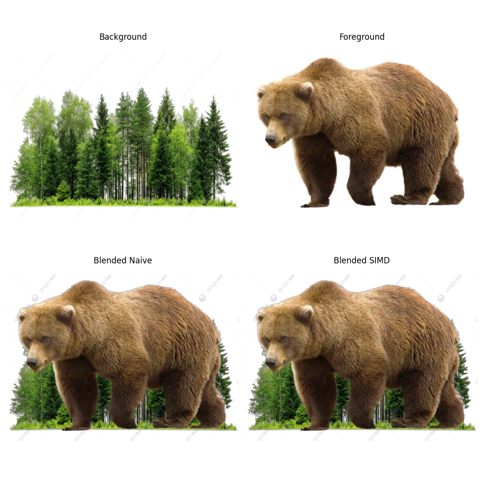

# Программирование на C++
## Лабораторная работа №2

Варианты 5, 6

Выполнил: **Иванов Матвей, группа P4144**

### Задание

Необходимо написать наивное (последовательное) решение на C++, и векторизованное решение, использующее SIMD-инструкции:

5. выполнить смешивание двух изображений в RGBA-формате (`Result = Foreground * Alpha + Background * (1 - Alpha)`);
6. построить гистограмму яркости 8-битного монохромного изображения;

Необходимо сравнить производительность наивного и векторизованного решения. Для этого требуется выбрать метрику в зависимости от задачи (например, количество обрабатываемых байт в секунду). Входные данные нужно сгенерировать либо подобрать в любом доступном источнике.

### Общее описание

Были реализованы основные наивные и векторизованные решения для блендинга (вариант 5) и гистграмм (вариант 6). 
В качестве библиотеки для векторизации через SIMD-инструкции была выбрана `eve`, так как она предоставляет удобный интерфейс для работы и совместима со многими архитектурами процессоров (в частности моим ARM NEON).

Для задачи блендинга в векторизованном решении за один проход обрабатывается сразу 4 пикселя пизображения (16 байт данных RGBA изображения). 
Так как алгортим блендинга pixelwise, то есть не зависит от окресности пикселя, то решение хорошо векторизуется.

Для задачи построяния гистограмм, ыбло принято ограничение, что количество бинов, на которые будет разбиваться значения яркости пикселя является степерью двойки (до 256). 
Таким образом удалось следелать эффективное векторизованное решение на битовых сдвигах, рассчитывая бины для 16 пикселей в один проход.

Реализацию решения задачи блендинга можно посмотреть в [blend.cpp](blend.cpp) / [blend.h](blend.h)

Реализацию решения задачи построения гистограмм можно посмотреть в [hist.cpp](hist.cpp) / [hist.h](hist.h)

### Валидация

Далее были написаны две функции для валидации корректности результатов наивного и векторизованного решения. 
Прогонялись несколько тестов на синтетических и реальных изображенях, сверя результаты. 
По итогам, наивные и векторизованные решения работали с одинаковым качеством.
Корретность результатов для блендинга проверялась визально, путём объединения двух реальных RGBA изображний. 
На изображении ниже можно заметить, что алгортим блендинга работает корректно. 



Для проверки гистограмм был написан небольшой код на Python для визуализации гистограмм полученных гистограмм наивным и векторизованным методом, а также использя библиотеку Numpy.
На изображении ниже также можно заметить, что алгортим построения гистограмм работает корректно.


### Бенчмаркинг

Далее проводилась серия бенчмарков, в которых проверялась производительность каждой из функций, а после сравнивалась. 
В качестве основной метрики производительности была выбрана `MP / sec` - мегапиксели в секунду.

В итоге были полученны следующие лучшие результаты по всем кейсам:
```text
Function                 Best MP/sec    Best Speedup   
-------------------------------------------------------
blend_simd               1444.65        6.17x
blend_naive              234.21         -              
histogram_simd           3406.03        4.34x
histogram_naive          796.74         -              
```

А также следующие метрики по ускорению работы:
```text
Average histogram speedup: 3.48x
Max histogram speedup: 4.34x

Average blend speedup: 5.73x
Max blend speedup: 6.17x
```

То есть, в среднем скорость расчёта гистограмм увеличилась в 3.5 раза, а блендинга изображений в 5.7 раз.

Таким образом, благодаря векторизации, получилось значительно сократить вычислительное время и увеличить пропускную способность алгортимов.