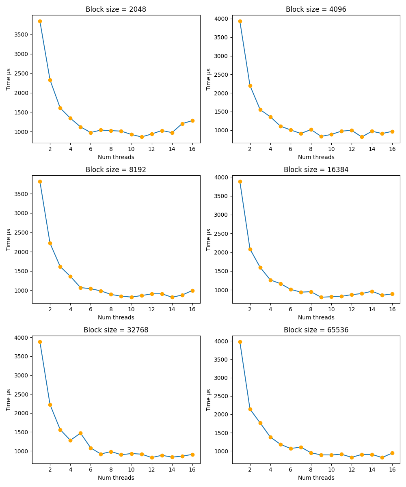
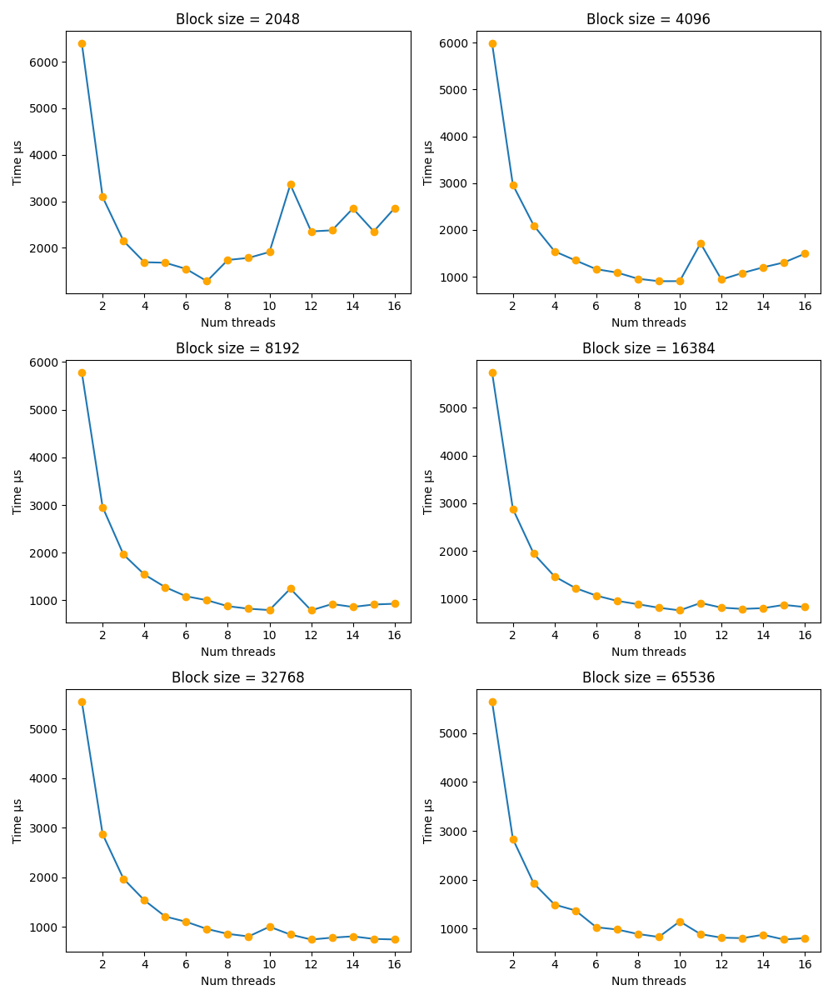

# Программирование на C++
## Лабораторная работа №3

Вариант 1

Выполнил: **Иванов Матвей, группа P4144**

### Задание

Необходимо написать свою реализацию пула потоков, предоставляющую следующий интерфейс:

```c++
class ThreadPool {
public:
    template<typename Fn, typename T>
    std::future<T> dispatch_task(Fn && f);
}
```

Реализация должна позволять задавать число потоков, выполняющих задачи. При добавлении в пул потоков большего количества задач, чем потоков, задачи должны попадать в очередь. Деструктор пула потоков должен отрабатывать корректно, дожидаясь выполнения всех поставленных в очередь задач.

В зависимости от варианта, необходимо использовать разные примитивы синхронизации внутри пула потоков:
0. Мьютексы и условные переменные.
1. **Атомарные переменные и спиннящиеся на них потоки.**

Затем, необходимо взять любой из своих вариантов второй работы, и реализовать его многопоточную версию (без SIMD). Нужно сравнить ускорение от многопоточной реализации с обычной и SIMD версией. Помимо этого, нужно оценить накладные расходы на распараллеливание кода.

### Общее описание

Был реализован основной интерфейс ThreadPool через атомарные переменные и спин-лупы.

Основная логика работы:
1. При создании ThreadPool создаётся заднное количество потоков (либо, если указан 0, то максимальное допустимное железом)
2. Каждый поток входит в свой worker_thread, в котором бесконечно крутится, до того, пока state_ не станет stopped
3. Функция dispatch_task упаковывает переданную функцию в shared packaged task, чтобы любой поток потом взять её на выполнение.
4. Новая задача добавляется в очередь, синхронизация просиходит через queue_lock_ атомарный флаг
5. Воркер берёт задачи из оччереди и исполняет, в остальное время - спин-луп
6. Когда вызывается stop (или деструктор) ThreadPool-а, сначала ожидается выполение всех оставшихся задач (новые ставить уже нельзя). После выполенния всех задач все воркеры удаляются.

Далее оба алгоритма из Лабороторной работы #2 были переписаны на многопоточную версию без SIMD.
Это были алгоритмы блендинга двух RGBA изображений по alpha-каналу, а также построение гистограммы яркости.

### Валидация

Для валидации корректности решений был дполнен алгоритм валидации из ЛР №2 для валидации также многопоточной версии алгоритмов. 
Прогонялись несколько тестов на синтетических и реальных изображенях, сверя результаты. 
По итогам, наивные, векторизованные и многопоточные решения работали с одинаковым качеством.

### Бенчмаркинг

Далее проводилась серия бенчмарков, в которых проверялась производительность каждой из функций, а после сравнивалась. 
В качестве основной метрики производительности была выбрана `MP / sec` - мегапиксели в секунду.

В итоге были полученны следующие лучшие результаты:

Для алгоритма смешивания изображений:
```text
Blend Algorithm:
Image Size     SIMD Speedup   Threaded Speedup Best Parameters          
----------------------------------------------------------------------
512x512        5.729713x      3.940506x        t=10,b=16384             
640x480        5.755703x      4.761596x        t=8,b=8192               
1241x932       5.082929x      5.937677x        t=10,b=16384             
1280x720       5.253545x      5.716765x        t=8,b=16384   
1920x1080      5.046408x      6.788254x        t=10,b=16384             
2000x2000      5.656590x      10.123250x       t=16,b=16384             
3840x2160      5.234689x      8.040235x        t=16,b=16384             
----------------------------------------------------------------------
Average        5.39x           6.47x
```

Видно, что в среднем многопоточная версия работала быстрее 5 из 7 случаев, при этом SIMD работает эффективнее на маленьких изображениях 

Для алгоритма построения гистограммы  изображений:
```text
Histogram Algorithm:
Image Size     SIMD Speedup   Threaded Speedup Best Parameters
----------------------------------------------------------------------
275x183        0.835428x      0.756586x        t=2,b=2048
512x512        1.135307x      1.060154x        t=4,b=65536
640x480        1.211025x      1.087466x        t=2,b=32768
1000x1000      1.184238x      2.385993x        t=6,b=32768
1280x720       1.152347x      2.137066x        t=4,b=32768
1920x1080      1.206278x      3.230875x        t=6,b=32768
2500x1666      1.015442x      6.696476x        t=16,b=32768
3840x2160      1.166379x      5.532183x        t=12,b=65536
----------------------------------------------------------------------
Average        1.11x           2.86x
```

Тут также видно, что многопточная версия чаще всего работала быстрее, чем SIMD версия, но опять же, на малых размерах изображений SIMD иногда показывал лучшую скорость.

Также были построенны графики для визуализации зависимости времени работы от количества параллельных потоков и от размера обрабатываемого потоком блока.

График для алгоритма блендинга:



График для алгоритма построения гистограммы яркости:




