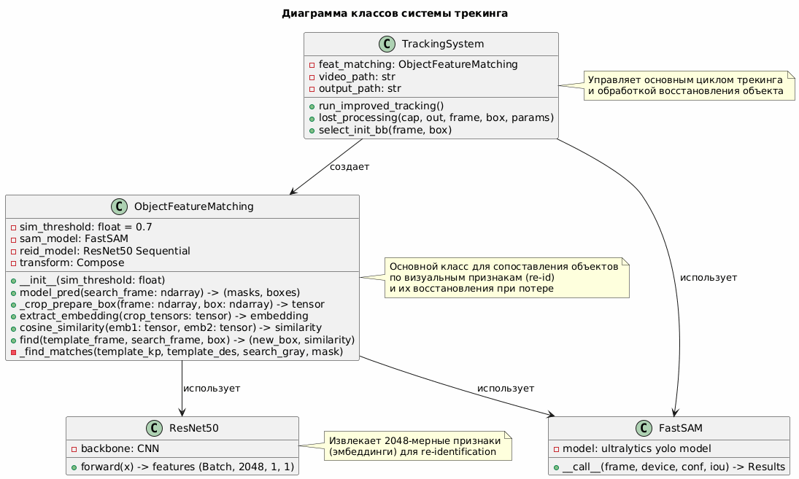

# CV Lab 2: Трекинг

## Описание задачи
Программа должна принимать на видео, первым кадром которого является крупное
изображение объекта, положение которого необходимо отследить. На каждом кадре видео,
где данный объект виден, вокруг него должна рисоваться рамка с подписью. В примере
объект прямоугольный и плоский, рамка должна максимально соответствовать реальному
положению и границам объекта.

## Реализация

### Архитектура решения
Решение основано на гибридном подходе, сочетающем классические методы компьютерного зрения и глубокое обучение:

1. **Инициализация объекта**
   - Обнаружение ключевых точек (Shi-Tomasi corner detector)
   - Сегментация первого кадра (FastSAM)
   - Извлечение эмбеддинга шаблона (ResNet-50)

2. **Трекинг в реальном времени**
   - Оптический поток Lucas-Kanade для отслеживания точек
   - Оценка аффинного/перспективного преобразования
   - Мониторинг потери точек

3. **Восстановление при потере**
   - Re-detection через FastSAM сегментацию
   - Re-identification с помощью косинусного расстояния эмбеддингов
   - Реинициализация ключевых точек

### Основные компоненты

#### ObjectFeatureMatching
Класс для идентификации и поиска объектов по визуальным признакам.

**Ключевые методы:**
- `init_template(frame, box)` — сохраняет эмбеддинг шаблонного объекта
- `find(frame)` — ищет объект на новом кадре, возвращает bb и степень схожести
- `get_quadrilateral_from_mask(mask, bbox)` — извлекает 4 угловые точки из маски объекта
- `model_pred(frame)` — запускает FastSAM сегментацию

**Используемые модели:**
- FastSAM (FastSAM-s.pt) — для сегментации объектов
- ResNet-50 — для извлечения признаков (Re-ID)

#### VideoTracker
Функции управления процессом трекинга:
- `run_tracking()` — основной цикл обработки видео
- `lost_processing()` — восстановление при потере >5% точек
- `select_init_bb()` — уточнение начального бокса через SAM

### Алгоритм работы

```
1. ИНИЦИАЛИЗАЦИЯ
   ├─ Чтение первого кадра
   ├─ Shi-Tomasi → обнаружение углов
   ├─ FastSAM → уточнение границ объекта
   └─ ResNet-50 → сохранение эмбеддинга шаблона

2. ОСНОВНОЙ ЦИКЛ ТРЕКИНГА
   Для каждого кадра:
   ├─ Lucas-Kanade → отслеживание точек
   ├─ Проверка потери точек
   │
   ├─ Если потеря < 5%:
   │  ├─ Оценка преобразования (Homography/Affine)
   │  ├─ Трансформация границ объекта
   │  └─ Отрисовка четырёхугольника
   │
   └─ Если потеря > 5%:
      ├─ FastSAM → сегментация кандидатов
      ├─ ResNet-50 → эмбеддинги кандидатов
      ├─ Cosine similarity с шаблоном
      ├─ Выбор лучшего совпадения (sim > 0.7)
      ├─ Извлечение четырёхугольника из маски
      └─ Реинициализация Shi-Tomasi точек
```

### Диаграмма алгоритма трекинга



### Диаграмма последовательности алгоритма трекинга


### Артефакты
Видео с результатами трекинга:

- [mona lisa](https://disk.yandex.ru/i/7lOWtsoKln5xfg)
- [book](https://disk.yandex.ru/i/8AWmZoSHPh694g)


### Результаты
- Устойчивость к частичным окклюзиям
- Точное следование за перспективными искажениями
- Автоматическое восстановление при временной потере объекта
